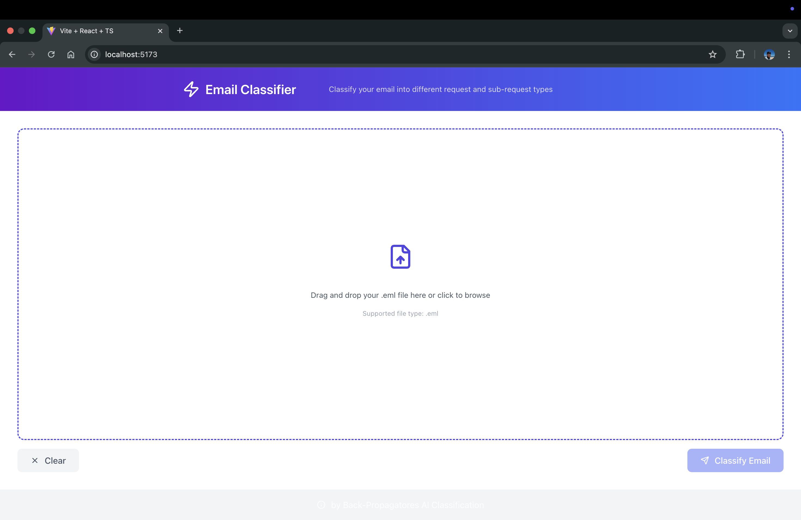

# 🚀 Project Name

## 📌 Table of Contents
- [Introduction](introduction)
- [Demo](#demo)
- [Inspiration](#inspiration)
- [What It Does](#what-it-does)
- [How We Built It](#how-we-built-it)
- [Challenges We Faced](#challenges-we-faced)
- [How to Run](#how-to-run)
- [Tech Stack](#tech-stack)
- [Team](#team)
- test-sh
---

## 🎯 Introduction
This project consists of a backend service built with Flask and a frontend application built with React and Vite. The backend handles email processing, including duplicate detection and storage, while the frontend provides a user interface for interacting with the backend.

## 🎥 Demo
📹 [Video Demo](artifacts/demo/demo.mp4)  
🖼️ Screenshots:



## 💡 Inspiration
In today's digital age, email communication is crucial for both personal and professional interactions. However, managing a large volume of emails can be challenging, especially when dealing with duplicate messages and ensuring important information is not lost. This project was inspired by the need to streamline email processing, detect duplicates efficiently, and provide a user-friendly interface for managing emails. By leveraging modern technologies like Flask, React, and Vite, we aim to create a robust solution that simplifies email management and enhances productivity.


## ⚙️ What It Does
This project integrates a Flask backend with a React frontend, using MongoDB and Redis for data storage and caching. Docker and Docker Compose are used for containerization and orchestration, making it easy to deploy and manage the application.

## 🛠️ How We Built It
We built this project using a combination of modern web development technologies and tools:

Backend: The backend is built with Flask, a lightweight Python web framework. We used pymongo to interact with MongoDB for persistent storage and redis-py to interact with Redis for caching. The backend processes emails, detects duplicates, and stores email details.
Frontend: The frontend is built with React, a popular JavaScript library for building user interfaces, and Vite, a fast build tool and development server. We used TypeScript for type checking and improved development experience.
Containerization: Docker was used to containerize both the backend and frontend applications. Docker Compose was used to orchestrate the multi-container setup, making it easy to manage and deploy the application.
Environment Management: We used .env files to manage environment variables securely, ensuring sensitive information like API keys and database URIs are not hardcoded in the source code.

## 🚧 Challenges We Faced
- Email Processing: Parsing and processing email data efficiently was a significant challenge. We had to ensure that the email content was correctly extracted and processed without losing any important information.
- Duplicate Detection: Implementing an efficient and accurate duplicate detection mechanism was crucial. We had to design a system that could quickly identify duplicate emails without causing performance bottlenecks.
Data Storage and Caching: Integrating MongoDB and Redis for data storage and caching required careful planning. We had to ensure that the data was stored and retrieved efficiently, and that the caching mechanism worked seamlessly with the database.
- Containerization: Containerizing the application and managing the multi-container setup with Docker Compose presented some challenges. We had to ensure that the containers were correctly configured and that the services could communicate with each other effectively.

## 🏃 How to Run
1. Clone the repository  
   ```sh
   git clone https://github.com/Shivaram35144/gaied-back-propagators
   ```
2. Create a .env file in Backend Folder with the following values

- GENAI_API_KEY = {your_value}
- MONGO_URI = {your_value}
- REDIS_HOST = {your_value}
- REDIS_PORT = {your_value}
- REDIS_PASSWORD = {your_value}

## 🏗️ Tech Stack
- 🔹 Frontend: React / Typescript
- 🔹 Backend: Flask  / Django
- 🔹 Database: Redis / MongoDb
- 🔹 Other: Gemini API

## 👥 Team
- **Shivaram K K** - [GitHub](https://github.com/Shivaram35144) | [LinkedIn](https://www.linkedin.com/in/shivaram-k-k-406979247/)
- **Dibyadarsan Das** - [GitHub](https://github.com/lightningfast07) | [LinkedIn](https://www.linkedin.com/in/dibyadarsan-das-280aa2220/)
- **Mohammed Abid Ahmed** - [GitHub](#) | [LinkedIn](#)
- **Leena Jain** - [GitHub](#) | [LinkedIn](#)
- **Pareedhi Goyal** - [GitHub](#) | [LinkedIn](#)